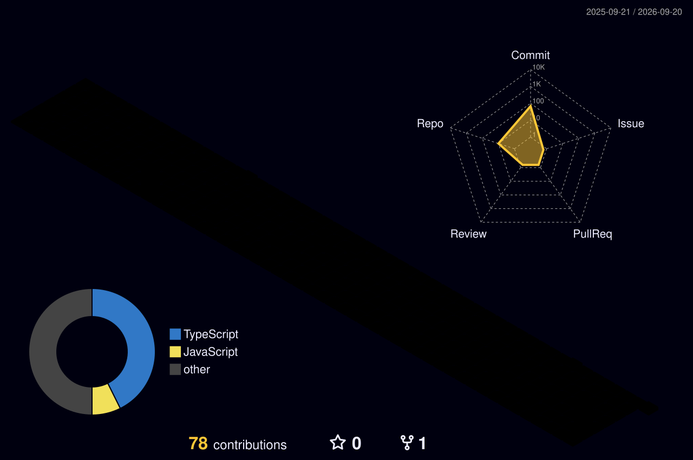

  

 

  

  

<h1 align="center">
  
  Hi, I'm Muthukumaran N
</h1>

  

 

  
  
  
  
  

 

  
  
  
  

  

---

## ◆ About Me

I'm a **Software Engineer & Full-Stack Developer** from Chennai, currently pursuing **B.Tech Information Technology** at Easwari Engineering College (**CGPA 8.22/10**).

I build production-grade systems across the stack — **Java Spring Boot**, **React.js**, and **SQL** — with system-level thinking around service boundaries, failure impact, and clean APIs. I've shipped features in the **US Mortgage domain**, designed **three end-to-end platforms**, and work at the intersection of **AI, Cloud, and DevOps**.

- ⚡ Specializing in **Spring Boot · REST APIs · React.js · JWT / RBAC**
- 🧠 Strong DSA core — **786+ problems**, **121 Hard**, contest rating **1820** (Top **7.47%** globally)
- ☁️ Hands-on with **IBM Cloud, Watson, Docker, Kubernetes, GitLab CI/CD**
- 🤖 Building **AI agents, NLP systems, and AIOps platforms**
- 🎯 Looking for **SDE / Full-Stack / Backend** roles where systems actually ship

  

---

## ◆ Tech Universe

  

 

**Languages**

**Backend & APIs**

**Frontend**

**Data**

**Cloud / DevOps**

**AI / ML**

<b>▸ Also familiar with</b>

 

`Microservices` · `Kafka` · `API Gateway` · `OAuth2` · `JUnit` · `Mockito` · `Hibernate` · `AWS EC2 / S3 / RDS` · `Terraform` · `Prometheus` · `Grafana` · `RAG` · `Vector DB` · `LangGraph` · `LLM APIs` · `MCP` · `DSA` · `OOP` · `DBMS` · `Operating Systems`

  

---

## ◆ GitHub Analytics

  
  

  

  

  

### 3D Contribution Universe

  

  

---

## ◆ Experience

### Full Stack Developer Intern — Sagent M&C Pvt. Ltd., Chennai
**Jan 2026 – Apr 2026** · Java · Spring Boot · React.js · SQL · Docker · Kubernetes

- Built and enhanced **8+ full-stack features/modules** across the project lifecycle — UI + backend service logic.
- Engineered containerized deployment with **Docker + Kubernetes** across **4+ services** and **2 environments**, improving packaging consistency and release reliability.
- Delivered a complete full-stack project from development through deployment across Agile sprints, translating **US Mortgage domain** workflows into working business requirements.

### AI & Cloud Intern — Edunet Foundation (IBM SkillsBuild + AICTE)
**Jul 2025 – Aug 2025** · IBM Cloud · Watson Studio · NLP · REST

- Built and deployed cloud-based AI apps on **IBM Cloud / Watson Studio / Watson ML**, managing model training through deployment.
- Developed NLP and conversational AI by integrating **Watson Assistant, Watson NLU, and REST APIs** into cloud-native workflows.
- Collaborated in Agile iterations to ship API-integrated AI features with clearly defined service interfaces.

  

---

## ◆ Featured Systems

### 01 — NGO Donation & Volunteer Management Platform
`Java` `Spring Boot` `React.js` `MySQL` `JWT` `Docker` `WebSocket`

End-to-end platform with **20+ REST endpoints** across **3 roles** (donor, volunteer, admin).

- JWT + **RBAC**, secure APIs, payment workflows, QR receipt verification, automated PDF receipts
- Real-time notifications via **Spring WebSocket**, Leaflet maps, analytics dashboards, email/SMS alerts

### 02 — AI DevOps Agent &nbsp; 
`Python` `FastAPI` `AI Agents` `GitLab CI/CD` `Claude AI`

LLM-powered DevOps automation that analyzes feedback, runs root-cause analysis, and ships fixes.

- Detects **5+ recurring issue categories** and surfaces actionable bug fixes
- GitLab CI/CD + Claude AI pipeline that prioritizes fixes and **auto-generates Merge Requests** — **10+ MRs** with minimal human intervention

### 03 — Predictive AIOps & Incident Intelligence Platform
`Java 17` `Spring Boot` `Spring Security` `PostgreSQL` `Redis` `Python` `FastAPI` `React` `Docker` `K8s`

Microservice telemetry, anomaly detection, and failure-risk prediction.

- Service boundaries + data flow between **Spring Boot services** and **Python ML** (Random Forest & Isolation Forest)
- Dependency-graph analysis and **blast-radius calculation** across **8 simulated microservices**
- JWT-secured APIs, WebSocket alerting (**6+ alert types**), Flyway persistence, containerized deploy with automated backend/ML/frontend verification

  

---

## ◆ LeetCode Arena

  

  <b>786+</b> problems &nbsp;·&nbsp; <b>271</b> Easy &nbsp;·&nbsp; <b>394</b> Medium &nbsp;·&nbsp; <b>121</b> Hard 
  Contest rating <b>1,820</b> &nbsp;·&nbsp; Top <b>7.47%</b> globally &nbsp;·&nbsp; <b>303</b> active days

  

---

## ◆ Education

**Easwari Engineering College, Chennai**  
B.Tech, Information Technology — **CGPA 8.22 / 10**  
Sep 2023 – Present  
Coursework: Data Structures & Algorithms · OOP · DBMS · Operating Systems

**Govt Boys Hr. Sec. School, Thiruvannamalai**  
HSC (Maths & Biology) — **86.83%** · 2023

  

---

## ◆ Certifications

| Credential | Issuer | When |
|---|---|---|
| **Oracle Certified Professional — Java SE 17 Developer** | Oracle | — |
| **IBM Data Science Professional Certificate** | IBM | Aug 2025 |
| **Google Data Analytics Professional Certificate** | Google | Sep 2025 |
| **SAP Certified: SAP Generative AI Developer** | SAP | Jul 2026 |

  

---

## ◆ Highlights

- 🏆 **Top 18% globally** — AgentathonX & GitLab Hackathon (AI DevOps agent)
- 🔥 **786+ LeetCode** · **121 Hard** · rating **1820** · Top **7.47%** · **303** active days
- 📜 **4 industry certifications** — Oracle, IBM, Google, SAP
- ☁️ Production-style internships in **US Mortgage** + **IBM Cloud AI**

---

## ◆ Contribution Snake

  <picture>
    <source media="(prefers-color-scheme: dark)" srcset="./output/github-contribution-grid-snake-dark.svg"/>
    <source media="(prefers-color-scheme: light)" srcset="./output/github-contribution-grid-snake.svg"/>
    
  </picture>

---

  

  <i>Designed to move. Built to ship.</i> 
  

