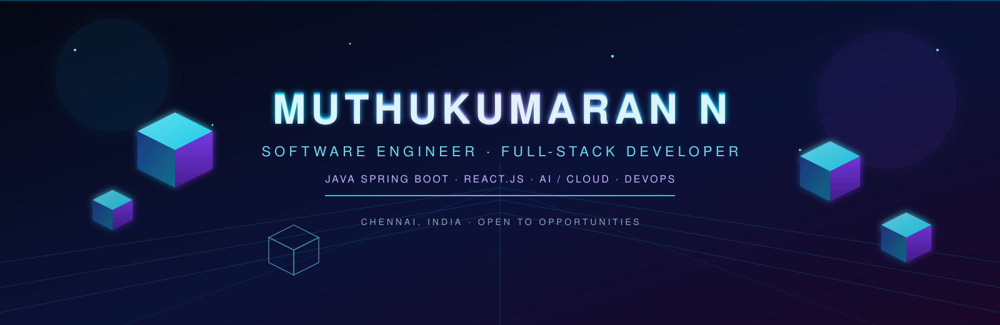

  

  <h1>Hi, I'm Muthukumaran N 👋</h1>
  
<strong>Software Engineer · Full-Stack Developer · Java · Spring Boot · React</strong>

  
  
  

## About me

I'm a Software Engineer and Full-Stack Developer from Chennai, pursuing B.Tech Information Technology at Easwari Engineering College. I build production-style systems with Java, Spring Boot, React.js, SQL, Docker, and cloud technologies.

- ⚡ Spring Boot, REST APIs, React.js, JWT/RBAC
- 🧠 Strong DSA foundation — 786+ problems solved
- ☁️ IBM Cloud, Docker, Kubernetes, GitLab CI/CD
- 🤖 AI agents, NLP systems, and AIOps platforms
- 🎯 Open to SDE, backend, and full-stack opportunities

## Tech stack

  

## GitHub analytics

<!-- The cache_seconds parameter prevents GitHub's image proxy from serving stale/error responses. -->

  
  

  

  

  

## Contribution graph

  <picture>
    <source media="(prefers-color-scheme: dark)" srcset="./output/github-contribution-grid-snake-dark.svg" />
    <source media="(prefers-color-scheme: light)" srcset="./output/github-contribution-grid-snake.svg" />
    
  </picture>

## Education

**Easwari Engineering College, Chennai** — B.Tech, Information Technology (CGPA 8.22/10)  
Sep 2023 – Present

  <i>Designed to move. Built to ship.</i>

